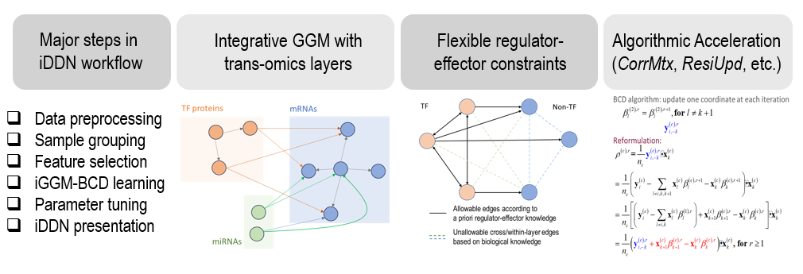

# iDDN

We developed an efficient and accurate multi-omics differential network analysis tool 
– integrative Differential Dependency Networks (iDDN).
iDDN is capable of jointly learning sparse common and rewired network structures, 
which is especially useful for genomics, proteomics, and other biomedical studies.
This repository provides the source code and examples of using iDDN.




## Installation
### Option 1: install from PyPI
iDDN can then be installed with the following command.
```bash
pip install iddn
```
<!-- ```bash
pip install --index-url https://test.pypi.org/simple/ --extra-index-url https://pypi.org/simple iddn
``` -->

If you meet any issue, one way is to install iDDN into a new Conda environment. 
To create and activate an environment named `iddn`, run this:
```bash
conda create -n iddn python=3.11
conda activate iddn
```
Then run `pip install iddn`.

### Option 2: install the development version

Alternatively, you can clone the repository, or just download or unzip it. Then we can install DDN 3.0.
```bash
$ pip install ./
```
Or you may want to install it in development mode.
```bash
$ pip install -e ./
```

## Usage

This toy example applies iDDN on a synthetic data. More details can be found in the first tutorial.
```python
from iddn import tools  # Run iDDN algorithm and process the output
from iddn_data import load_data  # Load example data and images
example = load_data.load_example("example.npz")
dat1 = example["dat1"]
dat2 = example["dat2"]
dep_mat = example["dep_mat"]
result = tools.iddn_basic_pipeline(dat1, dat2, dep_mat, lambda1=0.15, lambda2=0.05)
```

For more details and examples, check the [documentation](https://iddn.readthedocs.io/en/latest/), 
which includes four tutorials and the API reference.
The tutorials can also be found in the `docs/notebooks` folder.

## Tests

To run tests, go to the folder of DDN3 source code, then run `pytest`.
```bash
pytest tests
```
It will compare output of DDN with reference values. It tests iDDN with two acceleration strategies.

## Contributing

Please report bugs in the issues or email Yizhi Wang (yzwang@vt.edu).
If you are interested in adding features or fixing bug, feel free to contact us.

## License

The `iddn` package is licensed under the terms of the MIT license.

## Citations

[1] Yizhi Wang, Yi Fu, et al. "iDDN: Determining trans-omics 
network structure and rewiring with integrative differential dependency networks".
